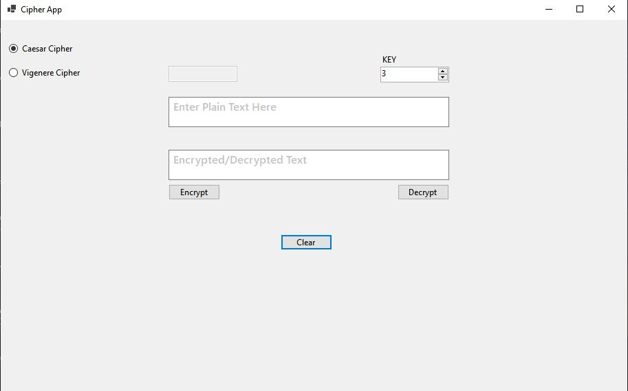
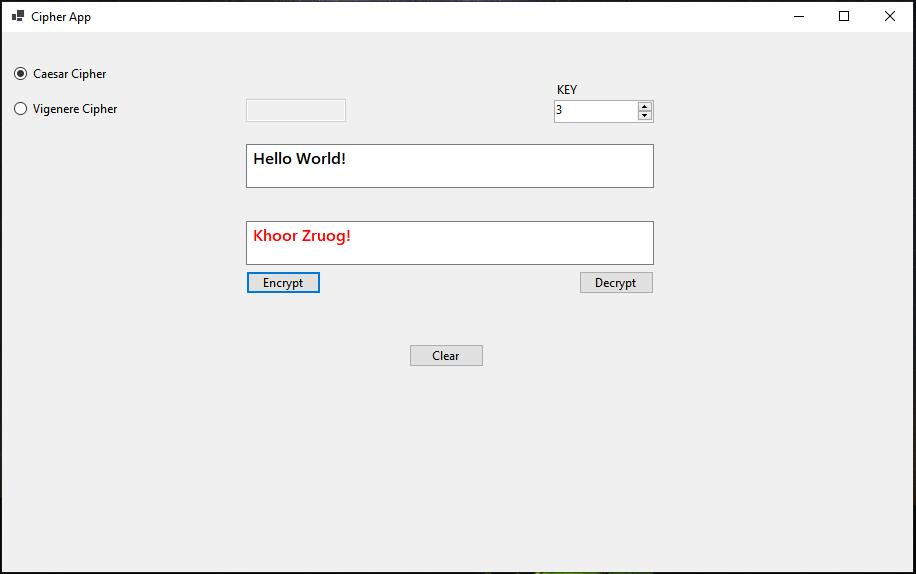
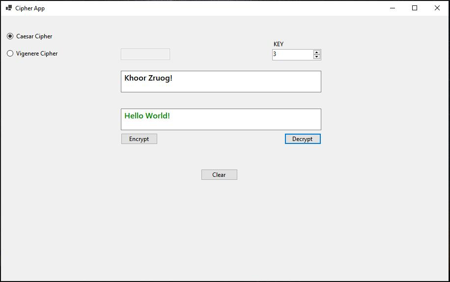
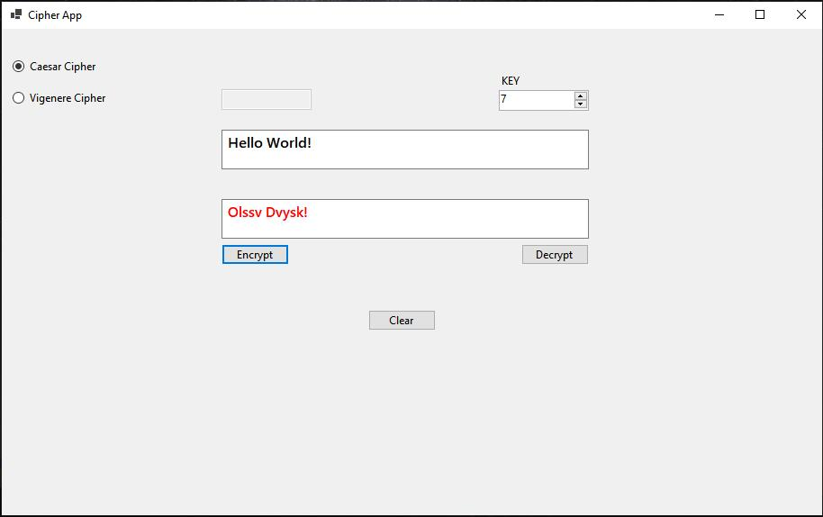
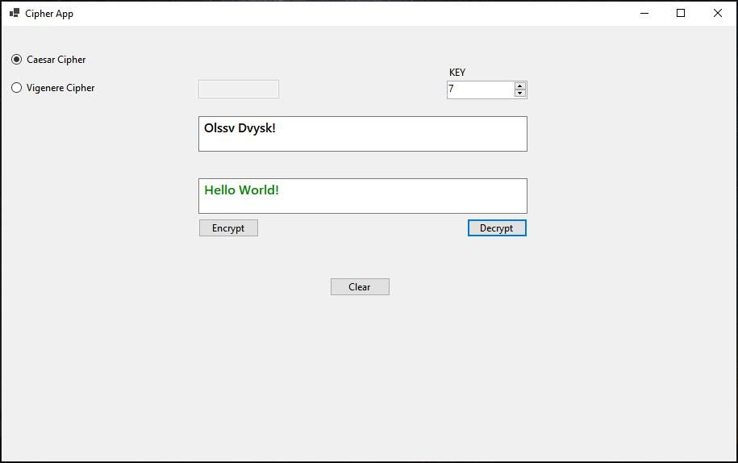
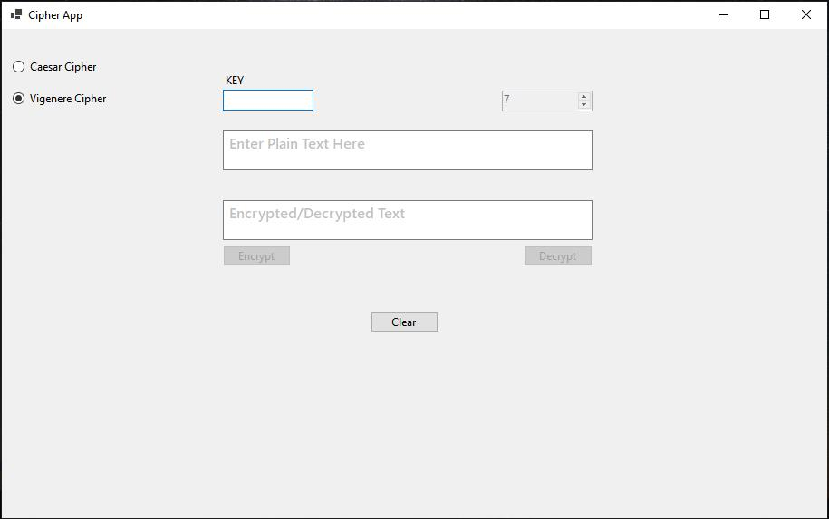
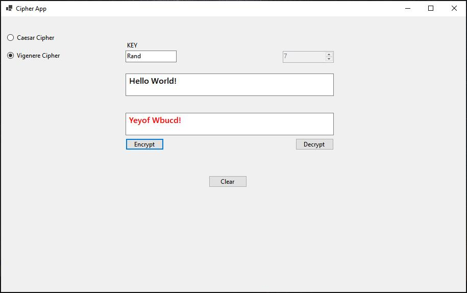
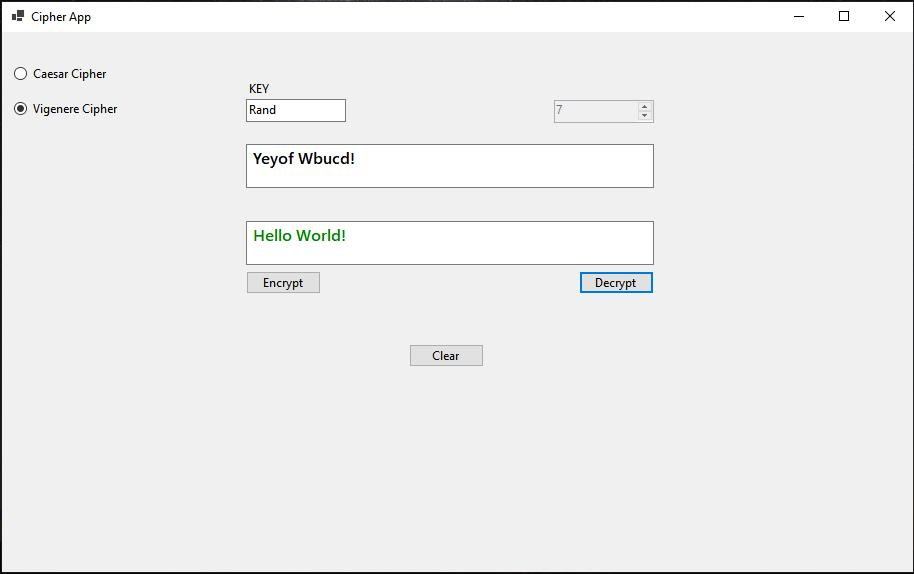

<h1>CipherApp</h1>

<h3>Project Description</h3>
The CipherApp is a utility app and also an educational tool, it encrypts and decrypts alphabetical text using either Caesar Cipher or Vigenere Cipher method.
<ul>
<li><b>The CipherApp was built using C# and Windows Forms(.NET Framework)</li>
   
<li>If Caeser Cipher is selected, the user is able to enter any key shift value from 1 to 25 to encrypt or decrypt text.</li>
<li>If Vigenere Cipher is selected, the user is able to enter alphebetical text as their key to encrypt or decrypt text.</li>
</ul>

<h3>Planned features and goals to be added to the project</h3>
<ul>
  <li>Adding other encryption methods</li>
  <li>Allowing for encryption of files</li>
  <li>Securing the app with user authentication</li>
  <li>Content explaining how this encryption methods work</li>
   
  <li>Potentially convert to an ASP.NET</li>
</ul>

<h3>Snippet of the CipherApp</h3>

<table>
  <thead>
    <tr>
      <th width="80%">Screenshot</th>
      <th width="20%">Description</th>
    </tr>
  </thead>
  <tbody>
    <tr>
      <td></td>
      <td>Interface on startup, Caesar Cipher is already selected with a key shift value of 3</td>
    </tr>
    <tr>
      <td></td>
      <td>Plaintext (i.e. Hello World!) is being encrypted with key shift value 3 and the results are shown in RED text.</td>
    </tr>
    <tr>
      <td></td>
      <td>Ciphertext is being decrypted with key shift value 3 and the results are shown in GREEN text.</td>
    </tr>
    <tr>
      <td></td>
      <td>Plaintext is being encrypted with a key shift value of 7 and the results are shown in RED text. A key shift can be from 1 to 25.</td>
    </tr>
    <tr>
      <td></td>
      <td>Ciphertext is being decrypted with key shift value 7 and the results are shown in GREEN text.</td>
    </tr>
    <tr>
      <td></td>
      <td>Vigenere cipher is selected, which now switches the key settings. The key now allows text to be used instead of a number</td>
    </tr>
    <tr>
      <td></td>
      <td>Plaintext is being encrypted with key: Rand and the results are shown in RED text.</td>
    </tr>
    <tr>
     <td></td>
      <td>Ciphertext is being encrypted with key: Rand and the results are shown in GREEN text.</td>
    </tr>
  </tbody>
</table>

